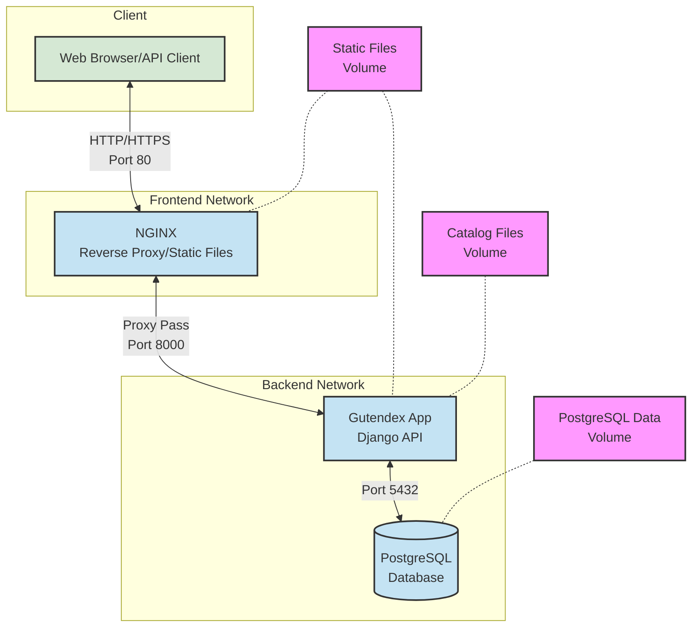

# Dockerized Gutendex with Nginx and PostgreSQL

This project provides a containerized setup for running Gutendex (a Project Gutenberg API) with Nginx reverse proxy and PostgreSQL database. The architecture follows a three-tier model with clear separation between services and network isolation.

## Architecture Overview



The application consists of three main tiers:
- **Frontend Tier**: Nginx server acting as a reverse proxy and static file server
- **Application Tier**: Gutendex API service (Django)
- **Database Tier**: PostgreSQL database server

### Network Architecture
The application uses two isolated networks:
- `frontend_network`: Connects Nginx with the application
- `backend_network`: Connects the application with the database

## Prerequisites

- Docker Engine
- Docker Compose

## Project Structure

```
├── gutendex/            # Gutendex application files
├── nginx/              # Nginx configuration and Dockerfile
├── postgres-setup/     # PostgreSQL setup files
├── docker-compose.yaml # Main orchestration file
└── .gitignore
```

## Development Workflow

This project follows a feature branch workflow:

1. **Main Branch**: 
   - The `main` branch contains the stable, production-ready code
   - All development work is branched from and merged back into `main`

2. **Feature Branches**:
   - Create a new branch for each feature or fix
   - Branch naming convention: `feature/description-of-change`
   - Example: `feature/add-nginx-caching`

3. **Workflow**:
   ```bash
   # Create a new feature branch
   git checkout main
   git pull
   git checkout -b feature/your-feature-name

   # Make changes and commit
   git add .
   git commit -m "Description of changes"

   # Push changes
   git push origin feature/your-feature-name

   # After feature is complete and reviewed
   git checkout main
   git pull
   git merge feature/your-feature-name
   git push
   
   # Clean up by deleting the feature branch
   git branch -d feature/your-feature-name
   git push origin --delete feature/your-feature-name
   ```

## Features

- Three-tier architecture with isolated components
- Automated static file serving through Nginx
- Network isolation for enhanced security
- Persistent data storage using Docker volumes
- Optimized Docker images using multi-stage builds
- Health checks for database connectivity
- Automated database migrations and static file collection

## Quick Start

1. Clone the repository:
```bash
git clone <repository-url>
cd <repository-name>
```

2. Start the services:
```bash
docker-compose up -d
```

The application will be available at `http://localhost:80`

## Services Configuration

### Nginx
- Serves as reverse proxy for the application
- Handles static file serving with caching
- Listens on port 80
- Configured to proxy API requests to the application server

### Gutendex Application
- Runs on Python 3.9
- Automatically performs database migrations on startup
- Collects static files
- Updates catalog data
- Configured with environment variables for database connection

### PostgreSQL Database
- Persistent data storage using Docker volumes
- Isolated in the backend network
- Includes health checks for reliability

## Environment Variables

The following environment variables are pre-configured in the docker-compose file:

```yaml
DATABASE_NAME: gutendex
DATABASE_USER: gutendex
DATABASE_PASSWORD: gutendex_password
DATABASE_HOST: db
DATABASE_PORT: 5432
DEBUG: true
ALLOWED_HOSTS: localhost,127.0.0.1,0.0.0.0
STATIC_ROOT: /app/staticfiles
STATIC_URL: /static/
MEDIA_ROOT: /app/media
```

## Volumes

The project uses three Docker volumes for persistent data:
- `postgres_data`: Database files
- `static_data`: Static files served by Nginx
- `catalog_data`: Gutendex catalog files

## API Documentation

For detailed information about the Gutendex API endpoints and usage, please refer to the original [Gutendex documentation](http://gutendex.com).

## Troubleshooting

If the services don't start properly:

1. Check container logs:
```bash
docker-compose logs -f
```

2. Verify all services are running:
```bash
docker-compose ps
```

3. Ensure all required ports are available (especially port 80)

4. If database connection issues occur, try recreating the containers:
```bash
docker-compose down -v
docker-compose up -d
```
